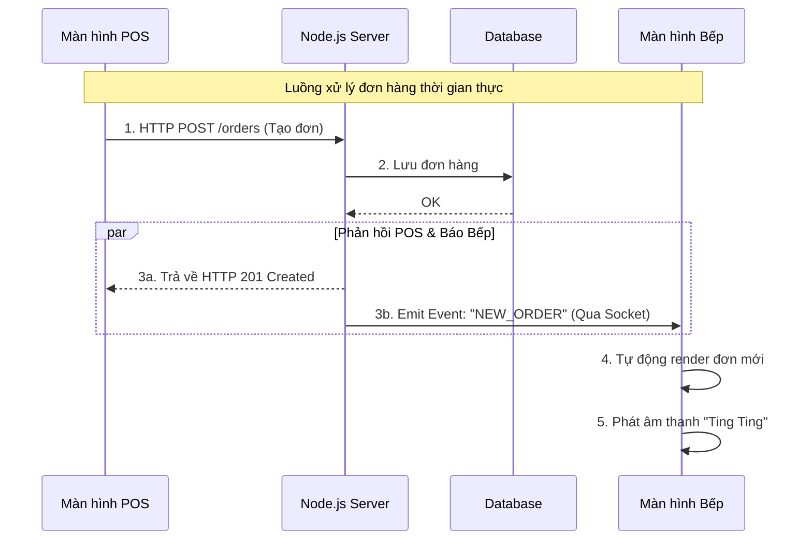

# Lộ trình Phát triển Giai đoạn 2: Nâng cao & Tối ưu hóa

**Trạng thái:** 🚀 Đang khởi động
**Mục tiêu:** Chuyển đổi dự án từ mức "MVP" (Sản phẩm khả dụng tối thiểu) sang mức "Production-ready" (Sẵn sàng cho thực tế).

---

## 1. Các tính năng mở rộng (Proposed Modules)

Dưới đây là 4 trụ cột công nghệ sẽ được tích hợp để giải quyết các bài toán thực tế của quán cà phê:

### A. Hệ thống Bếp Thời gian thực (Real-time Kitchen Display System - KDS)
* **Vấn đề:** Hiện tại, khi POS tạo đơn, đầu bếp không biết có đơn mới trừ khi tải lại trang (F5) liên tục.
* **Giải pháp:** Sử dụng công nghệ **WebSockets** để tạo kênh liên lạc 2 chiều.
* **Công nghệ:** `Socket.io` (Backend + Client).
* **Luồng hoạt động:**
    1. POS tạo đơn -> Gửi API.
    2. Server lưu DB -> Bắn tín hiệu "NEW_ORDER" qua Socket.
    3. Màn hình Bếp (Kitchen Client) nhận tín hiệu -> Tự động hiển thị đơn mới + Phát âm thanh.

### B. Quản lý Media (Image Upload)
* **Vấn đề:** Đang sử dụng link ảnh giả (`placehold.co`). Admin cần upload ảnh thật từ máy tính.
* **Giải pháp:** Tích hợp dịch vụ lưu trữ đám mây (Cloud Storage) thay vì lưu trực tiếp lên Server (để tiết kiệm băng thông và dễ deploy).
* **Công nghệ:** `Cloudinary` (Storage), `Multer` (Middleware xử lý file).

### C. Quản lý Server State (Caching & Sync)
* **Vấn đề:** Việc dùng `useEffect` và `useState` để gọi API là thủ công, không có bộ nhớ đệm (Caching), dễ gây dư thừa request.
* **Giải pháp:** Sử dụng thư viện quản lý trạng thái Server chuyên nghiệp.
* **Công nghệ:** `TanStack Query` (React Query).

### D. Dashboard & Báo cáo (Analytics)
* **Vấn đề:** Chủ quán cần biết doanh thu, món bán chạy.
* **Giải pháp:** Vẽ biểu đồ trực quan và viết các câu truy vấn tổng hợp (Aggregation).
* **Công nghệ:** `Recharts` (Biểu đồ), `Prisma GroupBy/Aggregate`.

---

## 2. Kiến trúc Hệ thống mở rộng

Sơ đồ luồng dữ liệu khi tích hợp Real-time (Socket.io):

---

## 3. Kế hoạch hành động chi tiết (Action Plan)
Chúng ta sẽ bắt đầu với Module A: Real-time (Socket.io) vì đây là tính năng quan trọng nhất để vận hành quy trình "Gọi món - Chế biến".

Các bước thực hiện:

### 1. Backend:

- Cài đặt socket.io.
- Cấu hình Server để chạy song song HTTP và WebSocket.
- Tạo các sự kiện: connection, join_room, new_order.

### 2. Frontend:

- Cài đặt socket.io-client.
- Tạo trang Kitchen.tsx dành riêng cho đầu bếp.
- Lắng nghe sự kiện từ Server để cập nhật UI.
