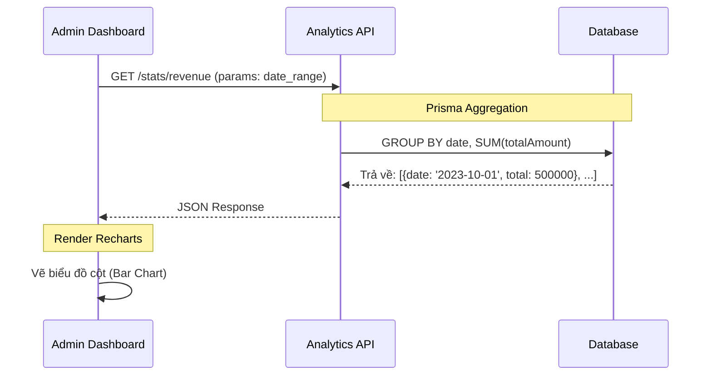

# Business Intelligence & Fintech (Mở rộng Thương mại)

**Trạng thái:** 🚀 Đang khởi động
**Mục tiêu:** Nâng cấp hệ thống với các tính năng thương mại cốt lõi: Báo cáo thống kê, Thanh toán Online, In hóa đơn và Phân quyền chặt chẽ.

---

## 1. Các Module mở rộng (Planned Modules)

### A. Dashboard & Analytics (Báo cáo Thống kê) - 📊 **(Ưu tiên)**
Chuyển đổi dữ liệu thô thành biểu đồ trực quan để hỗ trợ ra quyết định kinh doanh.

[Image of web application analytics architecture]

* **Tính năng:**
    * Thống kê tổng doanh thu (Ngày/Tuần/Tháng).
    * Biểu đồ cột: Doanh thu theo thời gian.
    * Biểu đồ tròn: Top món bán chạy (Best Sellers).
* **Kỹ thuật:**
    * **Backend:** `Prisma Aggregations` (GroupBy, Sum, Count), Raw SQL (nếu cần).
    * **Frontend:** Thư viện `Recharts` hoặc `Chart.js`.

### B. Payment Gateway (Thanh toán Trực tuyến) - 💳
Tích hợp cổng thanh toán để xử lý giao dịch không dùng tiền mặt.

* **Tính năng:**
    * Quét mã QR để thanh toán (Momo/VNPay/Stripe).
    * Xác nhận thanh toán tự động (IPN/Webhook).
* **Kỹ thuật:**
    * Third-party API (Momo Test Mode hoặc Stripe).
    * **Webhook Handling:** Xử lý callback từ server thanh toán về server mình để update trạng thái đơn hàng.

### C. In Hóa đơn & Xuất File (Invoicing) - 🖨️
Tạo hóa đơn vật lý hoặc file PDF cho khách hàng.
* **Tính năng:**
    * Xem trước hóa đơn (Preview).
    * In trực tiếp ra máy in nhiệt (Thermal Printer).
    * Xuất file PDF.
* **Kỹ thuật:** `react-to-print`, `jspdf`.

### D. Phân quyền nâng cao (RBAC) - 👮
Bảo mật hệ thống theo vai trò người dùng.
* **Tính năng:**
    * **Staff:** Chỉ được vào POS, Kitchen. Không được sửa giá, xóa món.
    * **Admin:** Toàn quyền (Dashboard, Quản lý nhân viên, Menu).
* **Kỹ thuật:** Middleware kiểm tra Role trong JWT Token, Protected Route nâng cao.

---

## 2. Kiến trúc Data Flow (Analytics Module)

Để vẽ được biểu đồ, dữ liệu cần được tổng hợp từ Backend trước khi gửi xuống Frontend.

## 3. Kế hoạch triển khai (Action Plan)
Chúng ta sẽ bắt đầu với Module A: Dashboard Analytics vì đây là tính năng mang lại giá trị hiển thị cao nhất.

1. Backend:

    - Viết API /stats/dashboard: Trả về tổng đơn, tổng tiền, khách hàng mới.
    - Viết API /stats/chart: Trả về dữ liệu mảng để vẽ biểu đồ.

2. Frontend:

    - Cài đặt recharts.
    - Tạo trang /admin/dashboard.
    - Vẽ biểu đồ doanh thu và danh sách top sản phẩm.

## 4. Checklist
- [ ] Analytics: API thống kê & Biểu đồ Recharts.
- [ ] Payment: Tích hợp Momo/Stripe & Xử lý Webhook.
- [ ] Invoice: In hóa đơn React component.
- [ ] Security: Middleware phân quyền Admin/Staff.