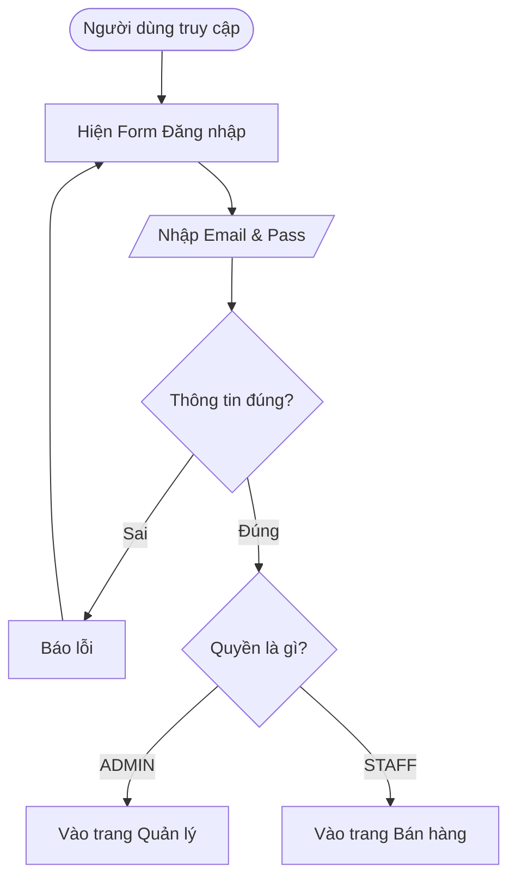

### 1. Luồng Đăng nhập & Phân quyền (Auth Flow)

```mermaid
graph TD
    Start([Người dùng truy cập]) --> LoginForm[Hiện Form Đăng nhập]
    LoginForm --> Input[/Nhập Email & Pass/]
    Input --> CheckCred{Thông tin đúng?}
    
    CheckCred -- Sai --> Error[Báo lỗi]
    Error --> LoginForm
    
    CheckCred -- Đúng --> CheckRole{Quyền là gì?}
    
    CheckRole -- ADMIN --> Dashboard[Vào trang Quản lý]
    CheckRole -- STAFF --> POS[Vào trang Bán hàng]
```