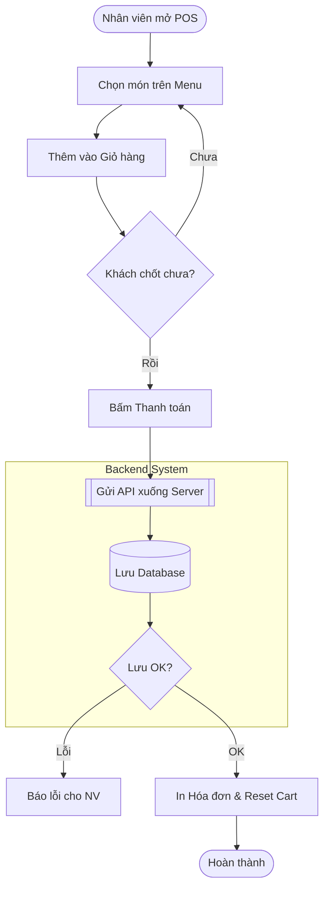

### 2. Luồng Bán hàng (POS Order Flow)

```mermaid
flowchart TD
    Start([Nhân viên mở POS]) --> SelectItem[Chọn món trên Menu]
    SelectItem --> AddCart[Thêm vào Giỏ hàng]
    AddCart --> Confirm{Khách chốt chưa?}
    
    Confirm -- Chưa --> SelectItem
    Confirm -- Rồi --> Checkout[Bấm Thanh toán]
    
    Checkout --> API_Call[[Gửi API xuống Server]]
    
    subgraph Backend System
        API_Call --> DB[(Lưu Database)]
        DB --> CheckDB{Lưu OK?}
    end
    
    CheckDB -- Lỗi --> ErrorUI[Báo lỗi cho NV]
    CheckDB -- OK --> Print[In Hóa đơn & Reset Cart]
    
    Print --> End([Hoàn thành])
```