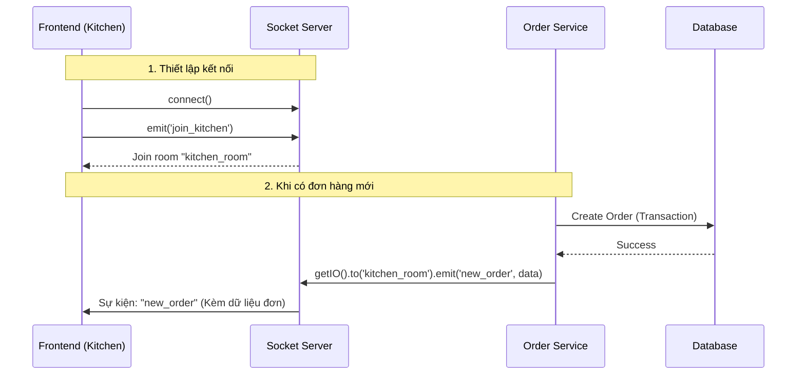

# Phase 2 (Phần 1): Tích hợp Real-time cho Backend

**Trạng thái:** ✅ Đã hoàn thành cấu hình Server
**Công nghệ:** `Socket.io`, `Node.js HTTP Server`
**Mục tiêu:** Chuyển đổi Server từ dạng Request-Response (Hòm thư) sang dạng Full-Duplex (Điện thoại) để phục vụ tính năng Bếp.

---

## 1. Kiến trúc Thay đổi (Architecture Changes)

Để Socket.io hoạt động chung cổng với Express API, chúng ta phải bọc ứng dụng lại bằng module `http` gốc của Node.js.


### Sơ đồ Luồng sự kiện (Event Flow)



---

## 2. Danh sách Sự kiện (Socket Events Documentation)

Đây là "hợp đồng" giao tiếp giữa Backend và Frontend.

| Tên sự kiện (Event Name) | Hướng (Direction) | Mô tả | Dữ liệu gửi kèm (Payload) |
| :--- | :--- | :--- | :--- |
| connection | Client -> Server | Khi Client kết nối thành công. | socket.id |
| join_kitchen | Client -> Server | Client xin vào phòng Bếp để nghe tin. | null |
| new_order | Server -> Client | Server báo có đơn hàng mới vừa tạo. | Object Order (kèm items) |


## 3. Triển khai Kỹ thuật (Implementation Details)

### A. Socket Singleton (src/socket.ts)
Sử dụng mẫu thiết kế Singleton để đảm bảo chỉ có 1 instance io duy nhất và có thể gọi nó từ bất kỳ Service nào.

```Typescript
export const initSocket = (httpServer) => {
  io = new Server(httpServer, {
    cors: { origin: ["http://localhost:5173", "[https://deployed-url.app](https://deployed-url.app)"] }
  });
  // Logic lắng nghe join room
  io.on('connection', (socket) => {
    socket.on('join_kitchen', () => socket.join('kitchen_room'));
  });
};

export const getIO = () => { /* Trả về io để Service sử dụng */ };
```

### B. Server Entry Point (src/index.ts)
Thay đổi cách khởi động server:

- Cũ: app.listen(...)
- Mới: httpServer.listen(...) (Trong đó httpServer bọc lấy app và socket).

### C. Trigger trong Service (src/services/order.service.ts)
Ngay sau khi transaction tạo đơn hàng thành công, bắn tín hiệu ngay lập tức.

```Typescript
// Sau khi prisma.order.create thành công
const io = getIO();
io.to('kitchen_room').emit('new_order', newOrder);
```

---

## 4. Checklist kiểm tra
- [x] Đã cài đặt socket.io.
- [x] Server khởi động không lỗi, log báo "Server Socket & API running".
- [x] Cấu hình CORS cho Socket khớp với Frontend.
- [x] Service Order đã tích hợp lệnh emit.

---

## 5. Bước tiếp theo
Chuyển sang Frontend (React):

1. Cài đặt socket.io-client.
2. Tạo trang Kitchen Dashboard.
3. Lắng nghe sự kiện new_order để cập nhật giao diện thời gian thực.
