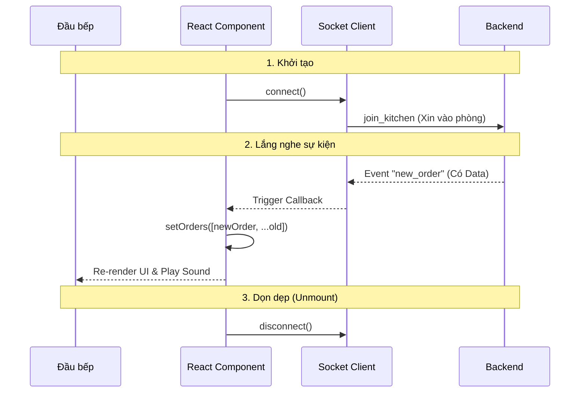

# Phase 2 (Phần 2): Xây dựng Màn hình Bếp (Kitchen Dashboard)

**Trạng thái:** ✅ Đã hoàn thành Frontend Real-time
**Công nghệ:** `React`, `socket.io-client`
**Mục tiêu:** Hiển thị đơn hàng ngay lập tức trên màn hình đầu bếp khi POS vừa thanh toán xong.

---

## 1. Luồng dữ liệu (Data Flow)

Khác với mô hình Request/Response truyền thống, ở đây Frontend đóng vai trò "Lắng nghe" (Listener) thụ động.



---

## 2. Triển khai Kỹ thuật

### A. Cài đặt & Cấu hình

```Bash
npm install socket.io-client
```

Tạo file src/services/socket.ts (Singleton Pattern) để quản lý kết nối duy nhất:

```TypeScript
import { io } from 'socket.io-client';
// AutoConnect = false để kiểm soát việc kết nối thủ công trong Component
export const socket = io(import.meta.env.VITE_API_URL, { autoConnect: false });
```

### B. Logic Component (Kitchen.tsx)

Sử dụng useEffect để quản lý vòng đời của kết nối Socket.

Quy tắc vàng: Luôn phải có hàm dọn dẹp (cleanup function) để tránh rò rỉ bộ nhớ hoặc nhân đôi sự kiện.

```TypeScript
useEffect(() => {
  // 1. Kết nối & Join phòng
  socket.connect();
  socket.emit('join_kitchen');

  // 2. Định nghĩa hàm xử lý
  const handleNewOrder = (data: KitchenOrder) => {
    // Cập nhật State kiểu Functional Update để luôn lấy được state mới nhất
    setOrders(prev => [data, ...prev]);
    alert("Có đơn mới!");
  };

  // 3. Đăng ký lắng nghe
  socket.on('new_order', handleNewOrder);

  // 4. CLEANUP (Quan trọng nhất)
  return () => {
    socket.off('new_order', handleNewOrder); // Gỡ sự kiện
    socket.disconnect(); // Ngắt kết nối
  };
}, []);
```

---

## 3. Checklist tích hợp (Integration Test)

Để kiểm tra tính năng Real-time hoạt động đúng:

1. Môi trường: Mở 2 Tab trình duyệt (Tab A: /kitchen, Tab B: /pos).
2. Hành động: Tại Tab B, thực hiện thanh toán một đơn hàng.
3. Kết quả mong đợi:
    - Tab A tự động xuất hiện đơn hàng mới ngay lập tức.
    - Không cần nhấn F5.
    - Console log tại Tab A hiện: 👨‍🍳 Nhận đơn mới: { ... }.

---

## 4. Các vấn đề thường gặp (Troubleshooting)

- Lỗi CORS: Nếu Console báo đỏ lòm lỗi CORS -> Kiểm tra lại socket.ts ở Backend xem đã whitelist domain của Frontend chưa.
- Duplicate Events: Một đơn hàng hiện lên 2 lần -> Do thiếu hàm socket.off trong useEffect cleanup.
- Không nhận được tin: Kiểm tra xem Client đã emit('join_kitchen') chưa, hoặc Server có emit đúng vào room kitchen_room không.

---

## 5. Tổng kết

Hệ thống hiện tại đã nâng cấp từ "Website tĩnh" sang "Ứng dụng thời gian thực".

- [x] Backend biết bắn tin (Emit).
- [x] Frontend biết nghe tin (Listen).
- [x] Quy trình POS -> Bếp đã thông suốt.