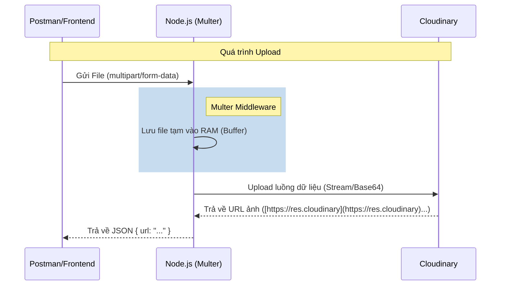

# Phase 2 (Phần 2): Quản lý Media (Upload Ảnh)

**Trạng thái:** ✅ Đã hoàn thành API Upload
**Công nghệ:** `Cloudinary`, `Multer`, `Node.js`
**Mục tiêu:** Cho phép Admin upload ảnh sản phẩm lên kho lưu trữ đám mây, thay vì lưu trên Server (để tránh mất dữ liệu khi deploy).

---

## 1. Vấn đề & Giải pháp

### Vấn đề: "Hệ thống tập tin vô thường" (Ephemeral Filesystem)
Trên các nền tảng Hosting hiện đại như **Render, Vercel, Heroku**:
* Server thường xuyên khởi động lại hoặc thay đổi.
* Mọi file lưu cục bộ (trong thư mục dự án) sẽ bị **XÓA SẠCH** sau mỗi lần deploy hoặc restart.

### Giải pháp: Cloud Storage
Sử dụng dịch vụ bên thứ 3 (Cloudinary) để lưu trữ. Server chỉ đóng vai trò trung gian chuyển file.

### Luồng dữ liệu (Upload Flow)



---

## 2. Cài đặt & Cấu hình

### A. Thư viện

```bash
npm install cloudinary multer
npm install @types/multer --save-dev
```

### B. Biến môi trường (.env)

Lấy từ Dashboard của Cloudinary:

```env
CLOUDINARY_CLOUD_NAME="xxxxx"
CLOUDINARY_API_KEY="123456789"
CLOUDINARY_API_SECRET="abcdefghijk"
```

---

## 3. Triển khai Kỹ thuật

### A. Config Cloudinary (src/config/cloudinary.ts)

```typescript
import { v2 as cloudinary } from 'cloudinary';

cloudinary.config({
  cloud_name: process.env.CLOUDINARY_CLOUD_NAME,
  api_key: process.env.CLOUDINARY_API_KEY,
  api_secret: process.env.CLOUDINARY_API_SECRET,
});

export default cloudinary;
```

### B. Controller Xử lý Buffer (src/controllers/upload.controller.ts)
Vì Multer lưu file vào RAM (req.file.buffer), ta cần chuyển đổi nó sang dạng Base64 DataURI để gửi lên Cloudinary.

```typescript
// Chuyển Buffer -> DataURI
const b64 = Buffer.from(req.file.buffer).toString('base64');
let dataURI = "data:" + req.file.mimetype + ";base64," + b64;

// Upload
const result = await cloudinary.uploader.upload(dataURI, {
  folder: 'coffee-shop-app',
});

// Kết quả quan trọng nhất: result.secure_url
```

### C. Route với Multer (src/routes/upload.routes.ts)
Sử dụng memoryStorage để không ghi file rác ra ổ cứng server.

```typescript
const storage = multer.memoryStorage(); // Lưu vào RAM
const upload = multer({ storage: storage });

// Chỉ cho phép upload 1 file, tên trường là 'image'
router.post('/', upload.single('image'), uploadController.uploadImage);
```

---

## 5. Tổng kết

- [x] Đã kết nối Cloudinary.
- [x] Đã cấu hình Multer để xử lý form-data.
- [x] API Upload hoạt động tốt, trả về link ảnh sống.