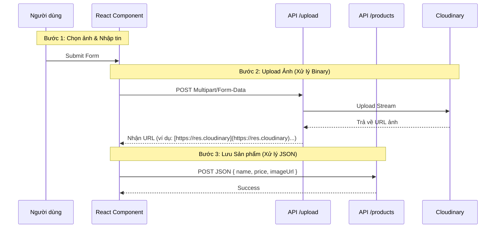

# Phase 2 (Phần 3): Frontend Upload Form

**Trạng thái:** ✅ Đã hoàn thành Giao diện Admin
**Công nghệ:** `React Hook Form`, `Axios`, `FormData`
**Mục tiêu:** Xây dựng giao diện thêm sản phẩm, xử lý upload ảnh lên Cloudinary và lưu thông tin vào Database.

---

## 1. Quy trình xử lý (Logic Flow)

Khác với các form nhập liệu văn bản thông thường (gửi JSON), form có file đính kèm cần tuân theo quy trình 2 bước để đảm bảo hiệu năng và cấu trúc dữ liệu.



## 2. Kỹ thuật cốt lõi
### A. Đối tượng FormData
Trình duyệt không thể gửi file qua JSON.stringify(). Chúng ta bắt buộc phải dùng đối tượng FormData chuẩn của Web API.

Code Service (src/services/product.service.ts):

```Typescript
export const uploadImage = async (file: File) => {
  const formData = new FormData();
  // 'image' là key mà Backend (Multer) đang chờ
  formData.append('image', file); 

  const response = await api.post('/upload', formData, {
    headers: {
      'Content-Type': 'multipart/form-data', // Bắt buộc
    },
  });
  return response.data.url;
};
```

### B. React Hook Form với File Input
react-hook-form trả về dữ liệu file dưới dạng một FileList (mảng), ngay cả khi chỉ chọn 1 file.

Code Component (src/pages/AdminProduct.tsx):
```Typescript
const onSubmit = async (data: any) => {
  // data.image là một mảng FileList
  const file = data.image[0]; 
  
  // 1. Upload lấy link trước
  const imageUrl = await uploadImage(file);
  
  // 2. Gom dữ liệu gửi đi
  const payload = {
    name: data.name,
    price: Number(data.price),
    imageUrl: imageUrl // Link ảnh từ Cloudinary
  };
  
  await createProduct(payload);
};
```

---

## 3. Checklist hoàn thành
Đến thời điểm này, dự án đã có đầy đủ các tính năng nâng cao:
- [x] Real-time: Socket.io (Bếp - Thu ngân).
- [x] Media: Cloudinary (Lưu trữ ảnh trên mây).
- [x] UX: Form upload có loading state, xử lý bất đồng bộ.
- [x] Deployment: Hệ thống đã sẵn sàng chạy trên môi trường thực tế