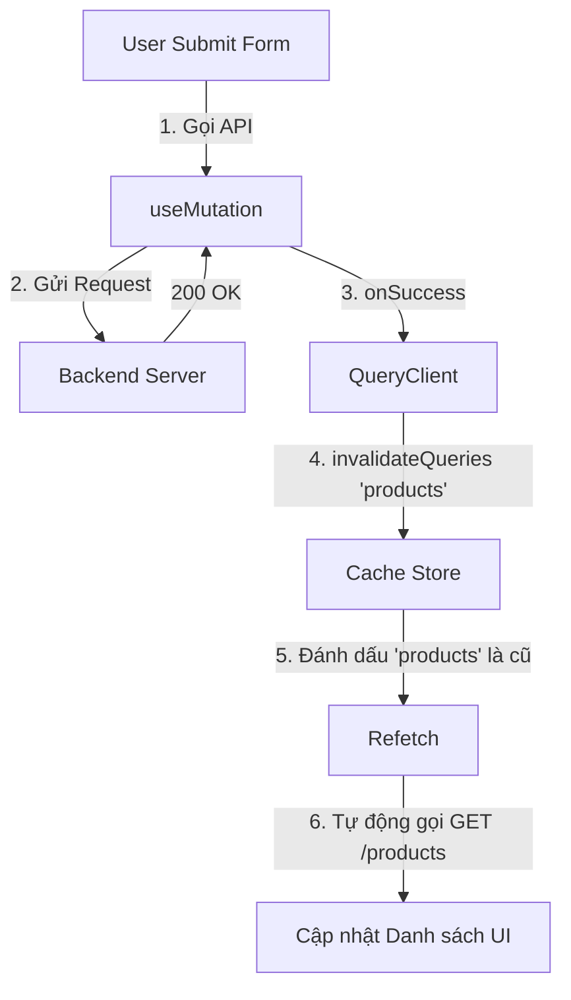

# Phase 2: Tối ưu hóa hiệu năng với TanStack Query

**Trạng thái:** ✅ Đã hoàn thành Refactoring
**Công nghệ:** `TanStack Query (React Query) v5`
**Mục tiêu:** Loại bỏ việc quản lý State thủ công, tích hợp Caching, và đồng bộ dữ liệu tự động giữa Server & Client.

---

## 1. Vấn đề & Giải pháp

### Cách cũ (Manual State Management)
Sử dụng `useEffect` + `useState`.
* ❌ **Redundant Requests:** Gọi lại API mỗi khi component mount (chuyển trang quay lại là tải lại).
* ❌ **Boilerplate Code:** Phải tự viết logic `isLoading`, `isError`, `try/catch` lặp đi lặp lại.
* ❌ **Stale Data:** Dữ liệu cũ không tự động cập nhật.

### Cách mới (Server State Management)
Sử dụng **TanStack Query**.
* ✅ **Caching:** Lưu dữ liệu vào bộ nhớ đệm. Nếu dữ liệu còn mới (fresh), trả về ngay lập tức (0ms latency).
* ✅ **Auto Refetch:** Tự động tải lại khi cửa sổ focus hoặc khi mạng kết nối lại.
* ✅ **Simplified Code:** Giảm 50% lượng code trong Component.

---

## 2. Kiến trúc Luồng dữ liệu (Data Flow)

### Mô hình "Stale-While-Revalidate"


React Query sử dụng chiến lược: "Hiển thị dữ liệu cũ (nếu có) ngay lập tức, đồng thời âm thầm gọi API để cập nhật dữ liệu mới".

### Quy trình Đồng bộ hóa (Mutation Flow)

Khi thêm/sửa/xóa dữ liệu, chúng ta cần báo cho Cache biết để tự làm mới.



---

## 3. Triển khai Kỹ thuật

### A. Setup Global (src/main.tsx)
Bọc ứng dụng bằng QueryClientProvider.

```tsx
const queryClient = new QueryClient({
  defaultOptions: {
    queries: {
      staleTime: 1000 * 60 * 5, // 5 phút (Dữ liệu được coi là mới trong 5p)
      refetchOnWindowFocus: false, // Tắt tự động fetch khi switch tab (tùy chọn)
    },
  },
});
```

### B. Fetching Data (src/pages/Menu.tsx)
Thay thế useEffect.

```tsx
// CŨ:
// useEffect(() => { getProducts().then(data => setData(data)) }, []);

// MỚI:
const { data: products, isLoading, error } = useQuery({
  queryKey: ['products'], // Key định danh duy nhất cho Cache
  queryFn: getProducts,
});
```

### C. Modifying Data (src/pages/AdminProduct.tsx)
Sử dụng useMutation để xử lý POST/PUT/DELETE và invalidateQueries để làm tươi dữ liệu.

```tsx
const queryClient = useQueryClient();

const mutation = useMutation({
  mutationFn: (newProduct) => createProduct(newProduct),
  onSuccess: () => {
    // Kích hoạt tải lại danh sách sản phẩm ngay lập tức
    queryClient.invalidateQueries({ queryKey: ['products'] });
    alert("Thêm thành công!");
  },
});

// Gọi hàm: mutation.mutate(data);
// Trạng thái loading: mutation.isPending
```

---

## 4. Tổng kết

1. Trải nghiệm người dùng: Chuyển trang mượt mà, không thấy Loading Spinner nếu đã có Cache.

2. Code Quality: Code sạch hơn, dễ bảo trì, tách biệt logic UI và logic Data.

3. Network Efficiency: Giảm số lượng request dư thừa tới Server.

## 5. Check List

- [x] Cài đặt @tanstack/react-query.

- [x] Cấu hình QueryClientProvider.

- [x] Refactor trang Menu (useQuery).

- [x] Refactor trang Admin (useMutation & Invalidation).