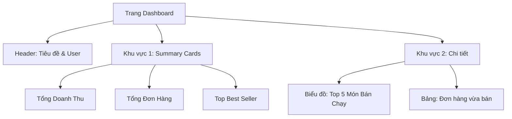

# Phase 3 (Phần 2): Frontend Analytics Dashboard

**Trạng thái:** ✅ Đã hoàn thành Giao diện Báo cáo
**Công nghệ:** `Recharts`, `Lucide React`, `React Query`
**Mục tiêu:** Biến dữ liệu thô từ API thành biểu đồ trực quan, giúp Admin theo dõi tình hình kinh doanh theo thời gian thực.

---

## 1. Kiến trúc Giao diện (UI Structure)

Giao diện Dashboard được chia thành 3 khu vực chính để tối ưu trải nghiệm người dùng:


---

## 2. Kỹ thuật Cốt lõi

### A. Thư viện sử dụng
- recharts: Thư viện vẽ biểu đồ mạnh mẽ nhất cho React (dựa trên SVG).
- lucide-react: Bộ icon nhẹ, hiện đại (Dollar, ShoppingBag...).

### B. Auto-Refetching (Cập nhật tự động)
Sử dụng tính năng refetchInterval của React Query để tạo hiệu ứng "Real-time" mà không cần dùng Socket (vì số liệu thống kê không cần quá tức thời từng mili-giây).

```tsx
const { data: stats } = useQuery({
  queryKey: ['dashboard_stats'],
  queryFn: getStats,
  refetchInterval: 30000, // Tự động gọi lại API mỗi 30 giây
});
```

### C. Responsive Chart
Sử dụng ResponsiveContainer của Recharts để biểu đồ tự động co giãn theo kích thước màn hình.

```tsx
<ResponsiveContainer width="100%" height="100%">
  <BarChart data={stats?.topSelling} layout="vertical">
    <XAxis type="number" />
    <YAxis dataKey="name" type="category" />
    <Bar dataKey="totalSold" fill="#3b82f6" />
  </BarChart>
</ResponsiveContainer>
```

---

## 3. Quy trình tích hợp (Integration Flow)

1. Service Layer: Gọi API /stats/dashboard đã xây dựng ở Backend.
2. Data Transformation: Dữ liệu từ API trả về đã được Backend format sẵn (đúng chuẩn mảng object) nên Frontend có thể ném trực tiếp vào prop data của Chart mà không cần xử lý thêm.
3. Error Handling: Hiển thị Loading State hoặc Error Message nếu API gặp sự cố.

---

### 4. Checklist
- [x] Cài đặt recharts và lucide-react.
- [x] Service getStats gọi API thành công.
- [x] UI Cards: Hiển thị đúng Tổng tiền & Tổng đơn.
- [x] UI Chart: Vẽ biểu đồ cột (BarChart) hiển thị Top Selling.
- [x] UI Table: Liệt kê danh sách đơn hàng mới nhất.
- [x] Routing: Đã bảo vệ route /admin/dashboard.