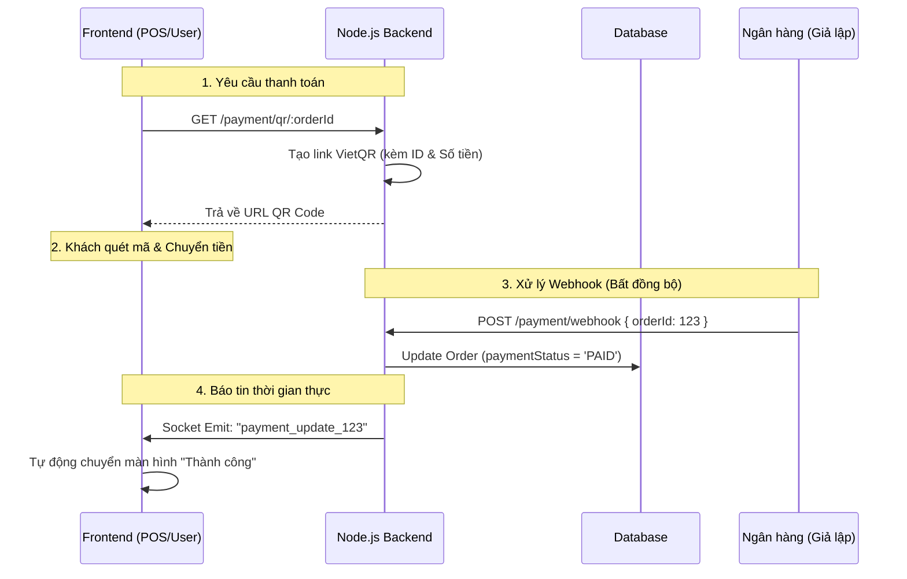

# Phase 3 (Phần 3): Backend Payment Gateway (VietQR & Webhook)

**Trạng thái:** ✅ Đã hoàn thành Backend Payment
**Công nghệ:** `VietQR API`, `Express`, `Socket.io`, `Prisma`
**Mục tiêu:** Tạo mã QR chuyển khoản động theo đơn hàng và xử lý xác nhận thanh toán tự động (IPN/Webhook).

---

## 1. Kiến trúc Thanh toán (Payment Architecture)

Quy trình thanh toán online là một quy trình bất đồng bộ. Server không chờ khách trả tiền ngay tại request tạo đơn, mà chờ tín hiệu từ Ngân hàng gửi về sau đó.


### Sơ đồ Luồng dữ liệu (Data Flow)



---

## 2. Thay đổi Cơ sở dữ liệu (Database Schema)
Cập nhật bảng Order trong schema.prisma để theo dõi trạng thái dòng tiền (khác với trạng thái làm món).

```prisma
model Order {
  // ...
  status        String   @default("PENDING") // Trạng thái bếp (PENDING/DONE)
  paymentStatus String   @default("UNPAID")  // Trạng thái tiền (UNPAID/PAID)
  paymentMethod String   @default("QR")      // Phương thức (CASH/QR)
}
```

---

## 3. Triển khai API

### A. Tạo QR (GET /payment/qr/:id)
Sử dụng dịch vụ VietQR (miễn phí) để tạo ảnh QR chứa thông tin chuyển khoản chính xác.

- URL Format: https://img.vietqr.io/image/<BANK>-<ACC>-compact.png?amount=...&addInfo=...
- Nhiệm vụ: Trả về link ảnh để Frontend hiển thị.

### B. Webhook (POST /payment/webhook)
Đây là endpoint quan trọng nhất. Trong thực tế, các cổng thanh toán (Momo, Stripe, Casso) sẽ gọi vào URL này khi có biến động số dư.

- Logic xử lý:

1. Nhận orderId từ Body.

2. Tìm đơn hàng và update paymentStatus = 'PAID'.

3. Quan trọng: Bắn sự kiện socket.emit để báo cho Frontend biết ngay lập tức mà không cần F5.

```tsx
// Snippet trong controller
const io = getIO();
io.emit(`payment_update_${orderId}`, { status: 'PAID' });
```

---

## 4. Hướng dẫn Kiểm thử (Testing Guide)
Vì chưa có App ngân hàng tích hợp thật, ta dùng Postman để đóng vai Ngân hàng.

1. Bước 1: Lấy QR

- GET http://localhost:3000/payment/qr/{order_id}

- Kết quả: Nhận được link ảnh QR.

2. Bước 2: Giả lập thanh toán (Trigger Webhook)

- POST http://localhost:3000/payment/webhook

- Body: { "orderId": {order_id} }

- Kết quả:

  - Database: Cột paymentStatus chuyển thành PAID.

  - Terminal Backend: Log báo "Đã thanh toán thành công".