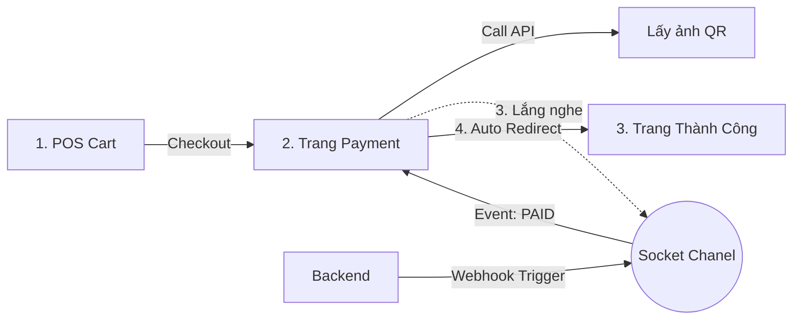

# Phase 3 (Phần 4): Frontend Payment UI (QR & Socket)

**Trạng thái:** ✅ Đã hoàn thành Full-stack Payment
**Công nghệ:** `React`, `Socket.io-client`, `TanStack Query`
**Mục tiêu:** Hiển thị mã QR động và tự động chuyển trang khi nhận được tín hiệu thanh toán thành công từ Server.

---

## 1. Luồng trải nghiệm (User Flow)

Chúng ta loại bỏ nút "Tôi đã thanh toán" thủ công. Thay vào đó, hệ thống tự nhận biết.



---

## 2. Triển khai Kỹ thuật
### A. Service Layer (src/services/payment.service.ts)
Gọi API để lấy thông tin QR (Link ảnh, Số tiền, Nội dung chuyển khoản).

```tsx
export const getPaymentQR = async (orderId: number) => {
  const response = await api.get(`/payment/qr/${orderId}`);
  return response.data;
};
```

### B. Logic Component (src/pages/Payment.tsx)
Sử dụng useEffect để thiết lập kênh lắng nghe Socket. Đây là trái tim của tính năng Real-time Payment.

Logic:

1. Mount component -> Kết nối Socket.
2. Đăng ký sự kiện: payment_update_{orderId}.
3. Khi sự kiện nổ ra -> setIsPaid(true) -> Hiển thị UI thành công.
4. Unmount component -> Hủy đăng ký sự kiện (Cleanup) để tránh rò rỉ bộ nhớ.

```tsx
useEffect(() => {
  if (!socket.connected) socket.connect();

  const eventName = `payment_update_${id}`;
  
  socket.on(eventName, (data) => {
    if (data.status === 'PAID') {
      setIsPaid(true); // Trigger re-render UI
      setTimeout(() => navigate('/menu'), 3000); // Chuyển trang sau 3s
    }
  });

  return () => {
    socket.off(eventName); // Quan trọng!
  };
}, [id]);
```

### C. Điều hướng từ POS
Cập nhật hàm Checkout tại POS.tsx để chuyển hướng người dùng sang trang thanh toán thay vì chỉ hiện thông báo.

```tsx
const handleCheckout = async () => {
  const order = await createOrder(cart);
  navigate(`/payment/${order.id}`); // Chuyển hướng
};
```

---

## 3. Kịch bản kiểm thử (Integration Test)
Để kiểm tra tính năng này hoạt động đúng luồng (End-to-End):

1. Môi trường:

- Tab 1: Ứng dụng React (Đang ở trang /payment/xxx).
- Tab 2: Postman (Giả lập Server Ngân hàng).

2. Hành động:

- Tại Tab 2: Gửi POST /payment/webhook với body { "orderId": xxx }.

3. Kết quả mong đợi:

- Tab 1 tự động chuyển từ hình QR sang màn hình xanh "Thành công" mà không cần reload.
- Sau 3 giây, tự động quay về Menu.