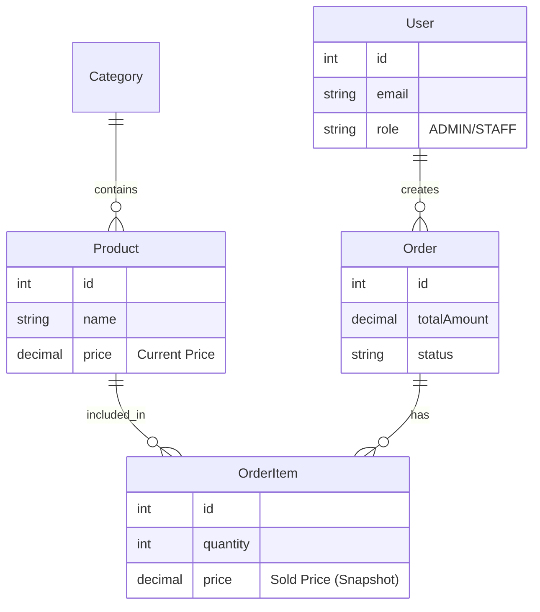

# Tổng kết Tuần 1: Khởi tạo Project & Cơ sở dữ liệu

**Thời gian hoàn thành:** Tuần 1
**Trạng thái:** ✅ Đã hoàn thành
**Mục tiêu:** Xây dựng nền móng Backend, thiết kế Database và kết nối MySQL.

---

## 1. Thành quả đạt được (Deliverables)

Sau tuần đầu tiên, dự án **Coffee Shop Management** đã có:

* [x] **Môi trường phát triển:** Đã thiết lập `Node.js` + `TypeScript` + `MySQL` hoạt động ổn định.
* [x] **Database Schema:** Đã chuyển hóa nghiệp vụ kinh doanh thành mô hình dữ liệu quan hệ (ERD) gồm 5 bảng: `User`, `Category`, `Product`, `Order`, `OrderItem`.
* [x] **Automation:**
    * Hiểu cách dùng **Migration** để đồng bộ cấu trúc bảng.
    * Hiểu cách dùng **Seeding** để tạo dữ liệu mẫu tự động.
* [x] **Tooling:** Biết sử dụng **Prisma Studio** để quản lý và kiểm tra dữ liệu trực quan.

---

## 2. Giải mã các khái niệm cốt lõi (Key Concepts)

### A. ORM (Prisma) - "Người phiên dịch"
**ORM (Object-Relational Mapping)** là công cụ giúp lập trình viên thao tác với Database bằng mã nguồn (JavaScript/TypeScript) thay vì viết câu lệnh SQL trần.

* **Góc nhìn Frontend:** Giống như việc dùng thư viện `Axios` để gọi API thay vì dùng `XMLHttpRequest` thô sơ.
* **Ví dụ so sánh:**

| Cách làm | Mã nguồn |
| :--- | :--- |
| **SQL Thuần** | `SELECT * FROM users WHERE email = 'admin@gmail.com';` |
| **Prisma (ORM)** | `prisma.user.findUnique({ where: { email: 'admin@gmail.com' } });` |

### B. Migration - "Git cho Database"
**Migration** là quá trình quản lý sự thay đổi cấu trúc của Database theo thời gian (Versioning).

* **Tại sao cần?**
    * Giúp đồng bộ cấu trúc dữ liệu giữa các thành viên trong team.
    * Lưu lại lịch sử thay đổi (Ví dụ: Ngày X thêm cột `phone`, ngày Y xóa bảng `test`).
* **Lệnh sử dụng:** `npx prisma migrate dev`

### C. Seeding - "Gieo mầm dữ liệu"
**Seeding** là kịch bản chạy code để nạp dữ liệu mẫu vào Database ngay lập tức.

* **Góc nhìn Frontend:** Thay vì tạo file `mockData.json` giả để test UI, ta nạp dữ liệu đó vào Database thật để test cả luồng API.

### D. Schema - "Bản thiết kế"
File `schema.prisma` đóng vai trò là bản thiết kế chi tiết (Blueprint).

* **Góc nhìn Frontend:** Nó tương đương với việc định nghĩa `interface` trong TypeScript hoặc `PropTypes` trong React. Nó quy định kiểu dữ liệu và mối quan hệ giữa các bảng.

---

## 3. Bài học về Tư duy (Mindset Shift)

### Từ Frontend sang Fullstack
| Frontend Mindset | Backend/Database Mindset |
| :--- | :--- |
| Quan tâm dữ liệu hiển thị thế nào (UI/UX). | Quan tâm dữ liệu **lưu trữ ở đâu** và **liên kết ra sao**. |
| Dữ liệu là JSON `response` tạm thời. | Dữ liệu là tài sản vĩnh viễn (Persisted Data). |
| Xử lý State cục bộ. | Xử lý **Tính toàn vẹn dữ liệu** (Data Integrity). |

### Ví dụ điển hình: Vấn đề lưu giá tiền (Pricing)
Trong dự án này, ta đã học được bài học quan trọng về thiết kế bảng `OrderItem`:

> **Vấn đề:** Tại sao bảng `OrderItem` (Chi tiết đơn hàng) phải lưu lại cột `price` trong khi bảng `Product` đã có giá rồi?

* **Lý do:** Giá sản phẩm trong bảng `Product` có thể thay đổi theo thời gian (lạm phát, khuyến mãi).
* **Giải pháp:** Khi bán hàng, phải **copy** giá tại thời điểm bán vào `OrderItem`.
* **Mục đích:** Để đảm bảo lịch sử đơn hàng và báo cáo doanh thu trong quá khứ không bị sai lệch khi giá hiện tại thay đổi.

---

## 4. Cấu trúc Database hiện tại

