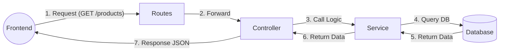

# Tuần 2: Kiến trúc Backend (3-Layer Architecture)

**Trạng thái:** ✅ Đã hoàn thành
**Mục tiêu:** Tái cấu trúc dự án từ "Spaghetti Code" (viết hết trong 1 file) sang mô hình phân tầng chuyên nghiệp, dễ bảo trì.

---

## 1. Tại sao cần phân tầng?

Việc viết tất cả logic vào file `index.ts` giống như việc viết toàn bộ logic của Frontend vào file `App.js`. Nó dẫn đến code khó đọc, khó sửa và khó test.

Chúng ta sử dụng mô hình **3 Tầng (Controller - Service - Data Access)** để tách biệt trách nhiệm (**Separation of Concerns**).

---

## 2. Mô hình "Nhà hàng" (The Restaurant Metaphor)

Để dễ hình dung, hãy tưởng tượng Backend server là một nhà hàng:

| Tầng (Layer) | Vai trò trong Code | Hình ảnh ẩn dụ | Nhiệm vụ chính |
| :--- | :--- | :--- | :--- |
| **Routes** | `routes/*.ts` | **Menu & Lễ tân** | Điều hướng khách (Request) đến đúng bàn phục vụ. |
| **Controller** | `controllers/*.ts` | **Bồi bàn (Waiter)** | Nhận yêu cầu, kiểm tra input, sai bồi bàn gọi Bếp, nhận món trả cho khách. **Không nấu ăn!** |
| **Service** | `services/*.ts` | **Đầu bếp (Chef)** | Thực hiện logic nghiệp vụ (Tính toán, xử lý). **Không quan tâm khách là ai.** |
| **Prisma/DB** | `PrismaClient` | **Kho nguyên liệu** | Nơi lưu trữ dữ liệu gốc. |

---

## 3. Luồng dữ liệu (Data Flow)

Dữ liệu trong ứng dụng sẽ chảy theo một chiều khép kín:



---
## 4. Bài toán nâng cao: Transaction (Giao dịch)

### Vấn đề "Được ăn cả, ngã về không"
Trong tính năng Tạo Đơn Hàng (`POST /orders`), chúng ta phải thực hiện 2 hành động ghi vào Database:
1.  Tạo bảng cha `Order` (Lưu tổng tiền, người mua).
2.  Tạo nhiều bảng con `OrderItem` (Lưu từng món, số lượng).

**Rủi ro:** Nếu tạo xong `Order` mà bị lỗi mạng không tạo được `OrderItem` -> Dữ liệu bị rác (Đơn hàng 0 đồng, không có món).

### Giải pháp: Database Transaction
Transaction đảm bảo tính **Nguyên tử (Atomicity)**:
* ✅ Nếu cả 2 bước thành công -> Lưu tất cả (`Commit`).
* ❌ Nếu 1 bước lỗi -> Hủy tất cả, quay về ban đầu (`Rollback`).

Trong Prisma, ta sử dụng tính năng **Nested Writes** (Ghi lồng nhau) để tự động xử lý việc này:

```typescript
// Chỉ cần 1 lệnh create duy nhất để tạo cả Cha lẫn Con
await prisma.order.create({
  data: {
    ...orderData,
    items: {
      create: [...] // Nếu dòng này lỗi, orderData cũng không được tạo
    }
  }
});
```
