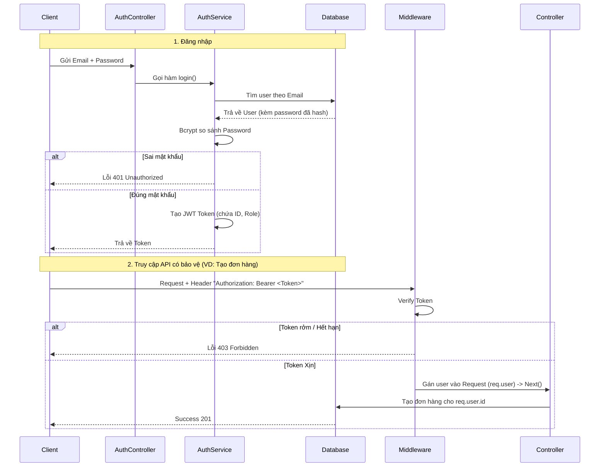

# Tuần 3: Bảo mật & Xác thực (Authentication)

**Thời gian hoàn thành:** Tuần 3
**Trạng thái:** ✅ Đã hoàn thành
**Mục tiêu:** Xây dựng hệ thống Đăng ký/Đăng nhập và bảo vệ API bằng JSON Web Token (JWT).

---

## 1. Tư duy Bảo mật Cốt lõi (Security Mindset)

Trước khi viết code, cần nắm vững 2 nguyên tắc bất di bất dịch:

### A. Mật khẩu (Password)
* **Nguyên tắc:** Tuyệt đối **KHÔNG** lưu mật khẩu dạng văn bản thường (plaintext) vào Database.
* **Giải pháp:** Sử dụng **Hashing** (Băm).
    * *Input:* `123456`
    * *Output:* `$2b$10$XyZ...` (Không thể dịch ngược lại).
* **Thư viện:** `bcryptjs`.

### B. Cơ chế Xác thực (Token-based Auth)
Thay vì dùng Session (lưu trên server), ta dùng **Token (JWT)** để xác thực.

* **Cơ chế:** "Chìa khóa vạn năng".
    1.  User đăng nhập đúng -> Server cấp 1 Token (vé).
    2.  User lưu Token (thường ở LocalStorage/Cookie).
    3.  Mỗi lần gọi API, User kẹp Token vào Header.
    4.  Server kiểm tra Token -> Nếu đúng chữ ký -> Cho phép đi qua.

---

## 2. Luồng dữ liệu (Authentication Flow)



---

## 3. Triển khai Kỹ thuật

Cài đặt thư viện
```bash
npm install bcryptjs jsonwebtoken
npm install @types/bcryptjs @types/jsonwebtoken --save-dev
```

Cấu hình Môi trường (.env)
```bash
JWT_SECRET=your-secret-key-here
```

---

### A. Service Logic (src/services/auth.service.ts)
Nơi xử lý Hashing và tạo Token.
```typescript
export class AuthService {
    constructor(private prisma: PrismaClient) {}

    async login(email: string, password: string) {
        const user = await this.prisma.user.findUnique({ where: { email } });
        if (!user) throw new Error('User not found');

        const isPasswordValid = await bcrypt.compare(password, user.password);
        if (!isPasswordValid) throw new Error('Invalid password');

        const token = jwt.sign({ id: user.id }, process.env.JWT_SECRET, { expiresIn: '1h' });
        return { token };
    }
}
```

### B. Middleware "Người gác cổng" (src/middlewares/auth.middleware.ts)
Đây là thành phần quan trọng nhất để bảo vệ API.
```typescript
export const verifyToken = (req: Request, res: Response, next: NextFunction) => {
    // 1. Lấy token từ Header
    const authHeader = req.headers.authorization;
    if (!authHeader) return res.status(401).json({ message: 'Unauthorized' });

    // 2. Kiểm tra token
    const token = authHeader.split(' ')[1];
    if (!token) return res.status(401).json({ message: 'Unauthorized' });

    // 3. Kiểm tra token hợp lệ
    jwt.verify(token, process.env.JWT_SECRET, (err, user) => {
        if (err) return res.status(403).json({ message: 'Forbidden' });
        req.user = user;
        next();
    });
};
```

### C. Áp dụng bảo vệ (src/routes/order.routes.ts)
```typescript
router.post(
    '/', 
    verifyToken, // <--- Đặt lính gác ở đây
    async (req, res) => {
    const { productId, quantity } = req.body;
    const order = await prisma.order.create({
        data: {
            userId: req.user.id,
            productId,
            quantity,
        },
    });
    res.json(order);
});
```

---

## 4. Bài học quan trọng: Controller thay đổi thế nào?
Khi đã có Auth Middleware, Controller không cần tin tưởng dữ liệu User ID từ req.body nữa.

- Trước khi có Auth: const userId = req.body.userId; (Rủi ro: Hacker có thể giả danh bất kỳ ai).

- Sau khi có Auth: const userId = req.user.id; (An toàn: ID này được lấy từ Token đã xác thực).

## 5. Checklist hoàn thành
- [x] Database: User password đã được lưu dạng Hash (Bcrypt).
- [x] API Auth: Đã có API /register và /login.
- [x] JWT: Server đã biết cấp Token và xác thực Token.
- [x] Protection: API /orders đã được bảo vệ, chỉ user đăng nhập mới gọi được.
