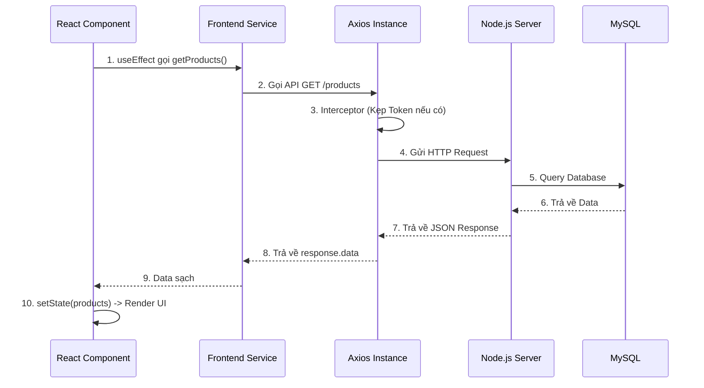
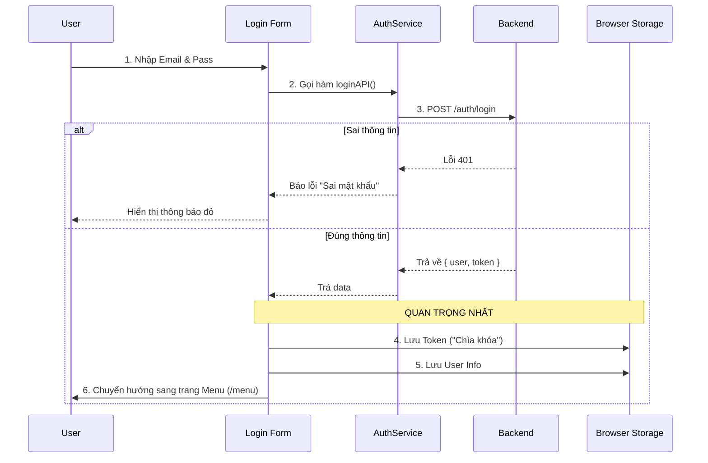
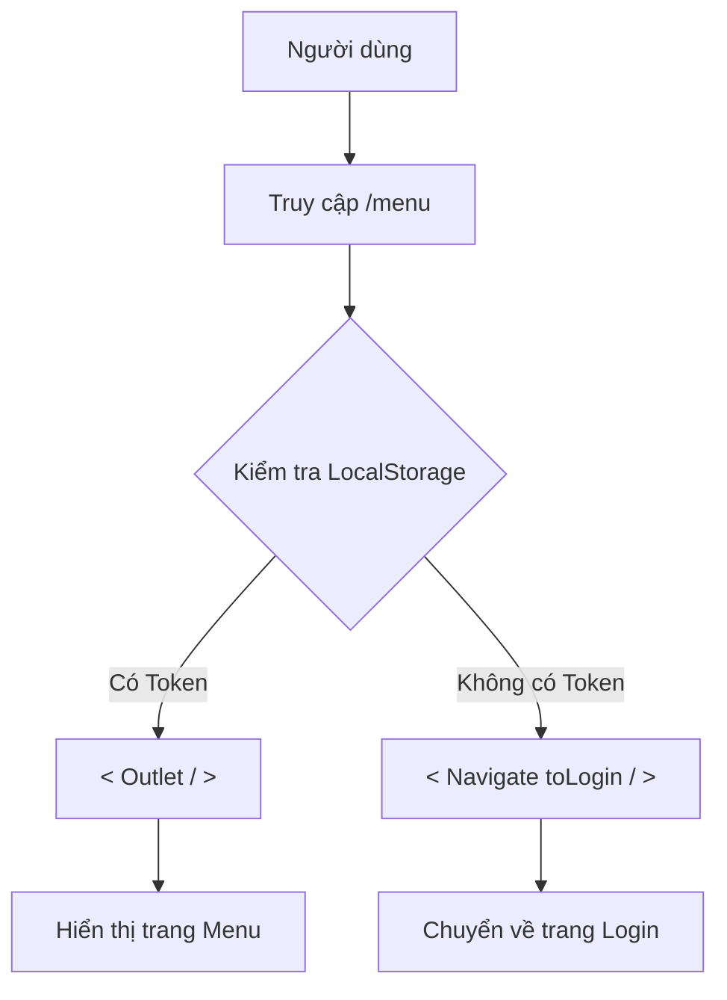

# Tuần 4: Xây dựng Frontend & Tích hợp hệ thống

**Thời gian hoàn thành:** Tuần 4
**Trạng thái:** ✅ Đã hoàn thành setup cơ bản
**Mục tiêu:** Khởi tạo dự án React, cấu hình TailwindCSS và kết nối thành công với Backend API.

---

## 1. Vấn đề cốt lõi: CORS (Cross-Origin Resource Sharing)


Trước khi Frontend và Backend nói chuyện được với nhau, ta phải xử lý bảo mật trình duyệt.

* **Vấn đề:** Trình duyệt chặn request từ `localhost:5173` (Frontend) sang `localhost:3000` (Backend) vì khác cổng (Port).
* **Giải pháp:** Cấu hình Backend cho phép Frontend truy cập.

**Cấu hình tại Backend (`src/index.ts`):**
```typescript
import cors from 'cors';
app.use(cors({
  origin: 'http://localhost:5173', // Chỉ cho phép domain này
  credentials: true // Cho phép gửi kèm cookie/token
}));
```

---

## 2. Tech Stack Frontend

- Framework: React (Vite)
- Language: TypeScript
- Styling: TailwindCSS
- HTTP Client: Axios
- Routing: React Router DOM

---

## 3. Kiến trúc thư mục Frontend

```bash
src/
├── components/   # Các UI nhỏ (Button, Input, Card)
├── pages/        # Các màn hình chính (Login, Home, POS)
├── services/     # Tầng giao tiếp API (Tương đương Service bên BE)
│   ├── api.ts            # Cấu hình Axios gốc
│   └── product.service.ts # Các hàm gọi API sản phẩm
├── App.tsx       # Routing & Layout
└── main.tsx      # Entry point
```

---

## 4. Tầng mạng (Networking Layer) - Axios Instance

Thay vì dùng fetch hoặc axios trần ở khắp nơi, ta tạo một Instance duy nhất.

Lợi ích:

1. DRY (Don't Repeat Yourself): Không cần gõ lại http://localhost:3000 nhiều lần.
2. Automation: Tự động đính kèm Token vào mọi request thông qua Interceptors.

Code mẫu (src/services/api.ts):

```typescript
import axios from 'axios';

const api = axios.create({
  baseURL: 'http://localhost:3000',
  headers: { 'Content-Type': 'application/json' }
});

// Interceptor: Tự động kẹp Token vào Header trước khi gửi
api.interceptors.request.use((config) => {
  const token = localStorage.getItem('token');
  if (token) {
    config.headers.Authorization = `Bearer ${token}`;
  }
  return config;
});

export default api;
```

---

## 5. Luồng dữ liệu (Integration Flow)



---

## 6. Checklist hoàn thành

- [x] Backend CORS: Đã mở cổng cho Frontend kết nối.

- [x] Project Setup: Vite + React + TS + TailwindCSS.

- [x] Architecture: Đã tạo cấu trúc folder services, pages, components.

- [x] API Client: Đã cấu hình Axios Instance và Interceptor.

- [x] Integration Test: Đã hiển thị được danh sách sản phẩm từ Database lên màn hình.

---

# Tuần 4 (Phần 2): Tích hợp Đăng nhập & Lưu trữ Token

**Thời gian hoàn thành:** Tuần 4
**Trạng thái:** ✅ Đã hoàn thành chức năng Login
**Mục tiêu:** Xây dựng giao diện đăng nhập, gọi API xác thực và lưu trữ JWT Token vào LocalStorage.

---

## 1. Luồng xử lý Đăng nhập (Login Flow)

Cơ chế xác thực phía Frontend hoạt động theo nguyên lý "Chìa khóa và Cái túi".



---

## 2. Các thư viện sử dụng

- react-hook-form: Quản lý form (Validate input, handle submit) mà không cần tạo quá nhiều state.

- react-router-dom: Điều hướng trang (useNavigate).

- axios: Đã cấu hình Interceptor ở phần trước (Tự động lấy token từ LocalStorage gửi đi).

---

# Tuần 4 (Phần 3): Bảo vệ Route (Private Route)

**Thời gian hoàn thành:** Tuần 4
**Trạng thái:** ✅ Đã hoàn thành bảo mật Frontend
**Mục tiêu:** Chặn người dùng chưa đăng nhập truy cập trực tiếp vào các trang nội bộ bằng cách gõ URL.

---

## 1. Khái niệm Private Route
Trong React Router v6, **Private Route** hoạt động như một lớp vỏ bọc (Wrapper Component). Nó kiểm tra điều kiện xác thực (Token) trước khi quyết định có hiển thị nội dung bên trong hay không.

### Luồng xử lý (Logic Flow)



---

# Tổng kết Tuần 4:

- [x] Core: Setup React + Tailwind + Axios Instance.

- [x] API: Kết nối Backend, xử lý CORS.

- [x] Auth: Đăng nhập, Lưu trữ Token, Logout.

- [x] Security: Bảo vệ các trang nội bộ (Private Route). 
