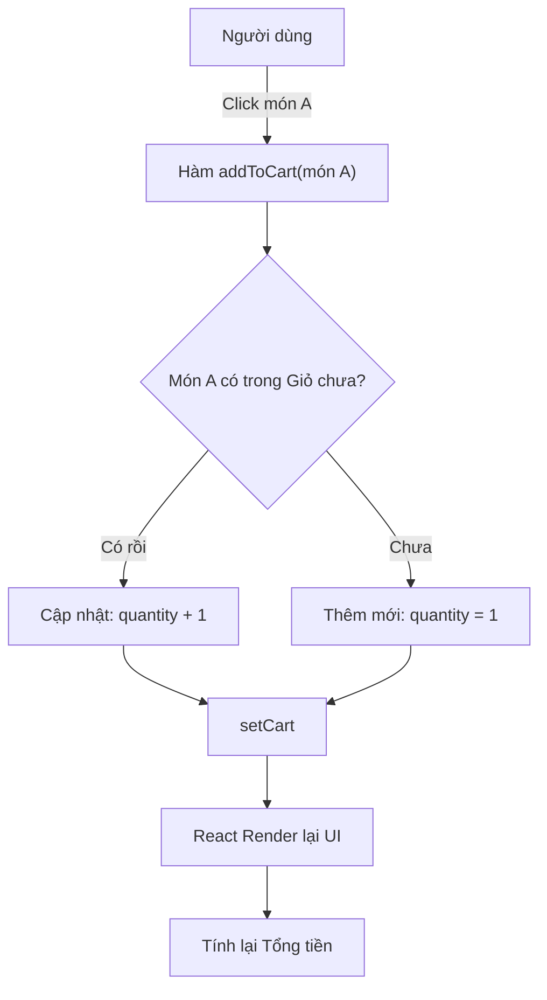

# Tuần 5: Xây dựng Module Bán hàng (POS System)

**Thời gian hoàn thành:** Tuần 5
**Trạng thái:** ✅ Đã hoàn thành tính năng Core
**Mục tiêu:** Xây dựng giao diện bán hàng (POS), xử lý logic giỏ hàng (Cart) và tích hợp API tạo đơn hàng.

---

## 1. Thiết kế Giao diện (UI Layout)
Giao diện POS được chia thành 2 cột chính, tối ưu cho thao tác nhanh:

* **Cột Trái (Product List):** Hiển thị danh sách món dạng Grid.
* **Cột Phải (Shopping Cart):** Hiển thị danh sách món đã chọn, số lượng, và nút thanh toán.

---

## 2. Luồng xử lý Logic Giỏ hàng (State Management)

Đây là phần phức tạp nhất. Chúng ta không dùng Redux (để giữ sự đơn giản) mà dùng `useState` cục bộ.

### Sơ đồ tư duy "Thêm vào giỏ" (Add to Cart Logic)

### 3. Checklist hoàn thành

- [x] UI Layout: Hiển thị danh sách sản phẩm và giỏ hàng.
- [x] Logic Giỏ hàng: Thêm, xóa, cập nhật số lượng sản phẩm.
- [x] Tính toán tổng tiền: Tính tổng tiền trong giỏ hàng.
- [x] Tích hợp API: Tạo đơn hàng thông qua API.
