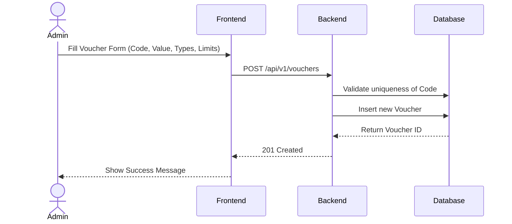
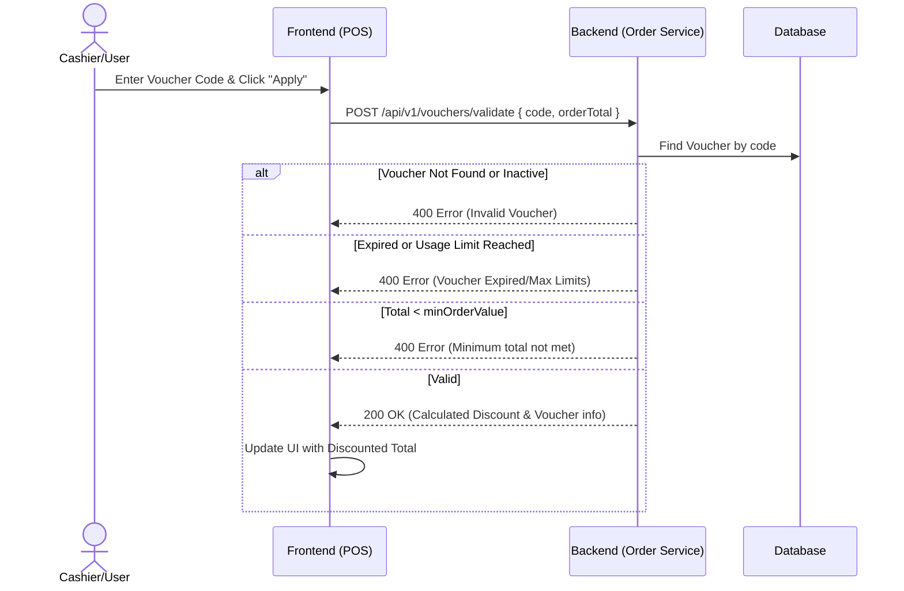

# Voucher Management Feature

## 1. Overview
The Voucher Management feature allows staff and admins of the Coffee Shop to create, manage, and distribute promotional vouchers. Customers or cashiers will apply these vouchers during checkout to receive discounts on their orders.

## 2. Business Logic
- **Voucher Creation:** Admins can create vouchers with a unique `code`.
- **Discount Types:** A voucher can be either a `PERCENTAGE` discount or a `FIXED` amount discount.
- **Constraints:**
  - `minOrderValue`: The minimum total order amount required to apply the voucher.
  - `maxDiscount`: For percentage discounts, the maximum discount amount allowed.
  - `startDate` and `endDate`: The validity period of the voucher.
  - `usageLimit`: Total number of times this voucher can be used across all orders.
- **Voucher Application:**
  - When applying a voucher to an order, the system validates the code, checks the dates, checks `usageLimit` vs `usedCount`, and verifies the `minOrderValue`.
  - The calculated discount is subtracted from the order's `totalAmount`.
  - The order records the `voucherId` and the `discount` applied.
  - Upon order completion, the voucher's `usedCount` is incremented.

## 3. Workflows

### 3.1 Voucher Creation (Admin)

### 3.2 Apply Voucher to Order (POS Cashier / User)

